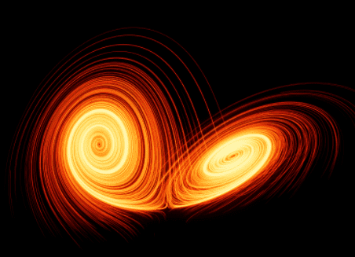

*non solus*

# About Me

# Details
I study AI.
I do yoga.
I play guitar.
I like games (mostly counter-strike).

Erdos number: 4

Krishnamacharya number: 3

# Education
## University
- 2022-now: PhD AI/CS ICR-CLAIM group, University Luxembourg
- 2019-2021 MSc Artificial Intelligence, University of Utrecht
  - Thesis: Probabilistic Deontic Logics
- 2015-2019 BSc Artificial Intelligence, Rijks University of Groningen
  - Thesis: Predicting in-vivo enzyme dynamics using a neural ordinary differential equation network.
- 2013-2015 Mathematics, University Leiden
  - Infinite dimensional sphere

## Yoga
- 25H Rocket Yoga
- 25H Rocket Yoga

# Publications

## 2025

- forthcoming
  - Conference poster: DEON 2025
- forthcoming
  - Workshop paper: CALM 2025

## 2024

- A Principle-based Analysis for Numerical Balancing - A Knoks, M Shao, L van der Torre, V de Wit, L Yu
  - Workshop paper: LNGAI 2024

## 2023

- Reasons in Weighted Argumentation Graphs - David Streit, Vincent de Wit, Aleks Knoks
  - Conference paper: LORI 2023: 251-259
- Rule rather than Exception: Defeasible Probabilistic Dyadic Deontic Logic - Vincent de Wit (under supervision of L. van der Torre and R. Markovich)
  - Conference poster: DEON 2023: 343-345
- Probabilistic Deontic Logics for Reasoning about Uncertain Norms - Vincent de Wit, Dragan Doder, John-Jules Ch. Meyer
  - Journal paper: FLAP 10(2): 193-220 (2023)

## 2022

## 2021

- A Probabilistic Deontic Logic - Vincent de Wit, Dragan Doder, John-Jules Ch. Meyer
  - Conference paper: ECSQARU 2021: 616-628
